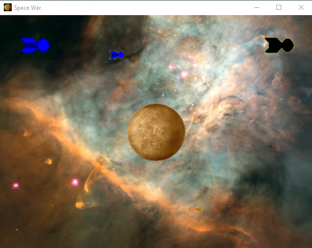

# 2DGameEngine
Simple 2D game engine
# Project as a video game engine for make a 2D games. 
## Supports next fututre:
* load texture based DirectX
* draw spite based DirectX
* input system
* audio system based on XACT
* basic math operation for 2D
* Entities, which maintain some physical law(collisions, velocity, position)
* text draw based on Direct Text Draw and just text sprite draw
* interactive element like a Input Dialog and Message Dialog
* console for debug game
* Network data exchange
* Custom memory allocator
* ThreadPool supported
## For programming game be inherited a Game2D class - implement pure virtual member function: update(), processAI(), colissions(), render().Initialize Game2D class and remainings class.

# Building dependency:
* Windows OS(x86/x64)
* DirectX 9
* MSVC 2017 or higher

# ***Sample Spacewar:***

<b>Game Space War</b>
 

